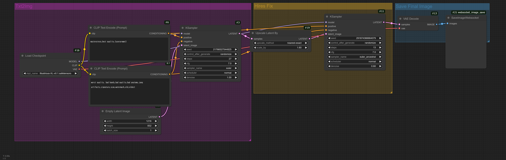
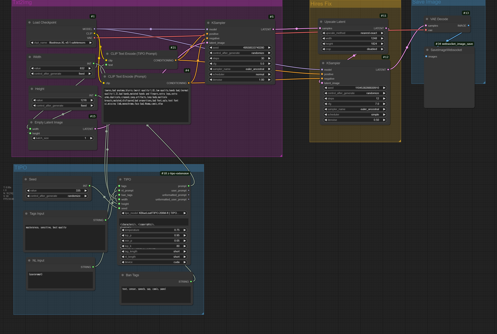

# Illustrious XL Basic

## LandScape(3:2 [1824 x 1248])


## Portait(2:3 [1248 x 1824])


## Setup
- Python 3.12.3
```bash
cd ComfyUI
pip install -r requirements.txt
pip install websocket-client

cd models/checkpoints
wget https://huggingface.co/OnomaAIResearch/Illustrious-xl-early-release-v0/resolve/main/Illustrious-XL-v0.1.safetensors

```

## Example
### LandScape
```bash
time python main.py --mode 1 --prompt "Yumekawa Tenshi's cute angel is flying in the winter sky" --save_path "./test.png"
```
NVIDIA L40S
```

```

### Portait
```bash
time python main.py --mode 2 --prompt "Yumekawa Tenshi's cute angel is flying in the winter sky" --save_path "./test.png"
```
NVIDIA L40S
```

```


